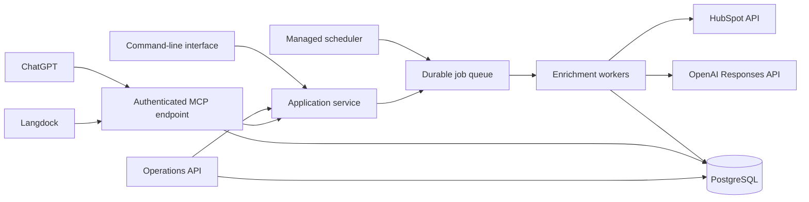

# HubSpot Processor Agent Architecture Concept

## Objective

Convert the current one-shot HubSpot enrichment application into a production-grade service that can be triggered through:

- Scheduled events such as cron or a managed cloud scheduler.
- ChatGPT.
- Langdock.
- The existing command-line interface.
- An internal operations API.

The application should not become an unrestricted, free-form autonomous agent. HubSpot enrichment and updates should remain controlled backend operations. ChatGPT and Langdock act as orchestration clients that invoke a small set of authenticated tools.

One Model Context Protocol (MCP) endpoint should serve both ChatGPT and Langdock, avoiding separate platform-specific integrations.

## Target architecture



The principal architectural rule is that triggers only create or inspect jobs. Long-running enrichment must run in workers and must not execute inside an HTTP or MCP request.

## Current application assessment

The existing code provides a useful foundation:

- Provider-independent domain types.
- A service layer separated from the HubSpot, AI, and report adapters through interfaces.
- An OpenAI Responses API adapter using structured output.
- Constrained HubSpot writes based on configured export properties.
- Per-operation timeouts and confidence thresholds.

The main production gaps are in orchestration and operations:

- `main.go` is a synchronous, one-shot command-line program configured through environment variables.
- The complete read, filter, enrich, write, and report workflow runs in one process.
- Eligibility relies primarily on the `ai_enriched_date` property.
- There is no durable idempotency, job state, run history, cancellation, or resumption.
- HubSpot updates happen immediately after individual enrichment operations.
- Reports are written to a local `result.md` file.
- There is no HTTP API, MCP endpoint, scheduler, queue, authentication, or authorization layer.
- HubSpot and OpenAI retry and rate-limit handling are incomplete.
- Enrichment results contain confidence values but do not persist complete evidence and provenance.
- There are currently no automated tests.

## Design principles

### Controlled execution

Agent clients request explicit operations through typed tools. They do not receive general access to HubSpot or arbitrary backend functions.

### Trigger neutrality

Cron, ChatGPT, Langdock, API requests, and the CLI must all call the same application service and produce the same run records.

### Asynchronous processing

Creating a run returns immediately with a run ID. Workers perform enrichment in the background, and clients poll or query the run status.

### Preview before write

Chat-triggered runs should default to preview mode. Applying changes should be a separate, explicitly approved operation.

### Idempotency and safe retries

Every trigger and record operation must be safe to retry without producing duplicate runs or repeated writes.

### Least privilege

Users and service identities receive only the scopes needed for their operations. Authorization is enforced in the backend for every tool call.

### Complete auditability

Every request, proposal, approval, external write, retry, and configuration change is associated with an actor, run, timestamp, and correlation ID.

## 1. Trigger-neutral application service

Move workflow orchestration out of `main.go` into a dedicated application package.

Suggested contracts:

```go
type RunRequest struct {
    TenantID       string
    ObjectType     string
    Mode           string // preview or apply
    Selection      Selection
    MaxRecords     int
    RequestedBy    Actor
    IdempotencyKey string
}

type RunResult struct {
    RunID     string
    Status    RunStatus
    Counts    RunCounts
    StartedAt time.Time
    EndedAt   *time.Time
}
```

The application layer should provide operations such as:

- `CreateRun`
- `PreviewRun`
- `ProcessRecord`
- `ApproveRun`
- `CancelRun`
- `RetryFailedRecords`
- `GetRun`
- `ListRuns`

The CLI becomes one adapter invoking these operations rather than owning the workflow.

## 2. Durable run state

Use PostgreSQL to persist operational state.

### `runs`

Store:

- Run ID and tenant ID.
- Trigger source and requester.
- Idempotency key.
- Object type and selection criteria.
- Preview or apply mode.
- Configuration and policy snapshot.
- Prompt and model version.
- Status and aggregate counts.
- Creation, start, completion, and cancellation timestamps.
- Token usage and estimated cost.

### `run_records`

Store:

- Run ID and HubSpot object ID.
- Original record version or `updatedAt` timestamp.
- Imported values used for research.
- Proposed values, confidence, and supporting evidence.
- Approval status.
- Write outcome.
- Attempt count and last error.
- Processing timestamps.

### `schedules`

This table is only necessary when schedules must be editable at runtime or through chat. Infrastructure-managed schedules can otherwise remain outside the application.

### `audit_events`

Record:

- Actor identity and source.
- Action and target.
- Run and record IDs.
- Correlation ID.
- Redacted request metadata.
- Timestamp and outcome.

### Run lifecycle

```text
queued -> running -> awaiting_approval -> completed
                  \-> partially_failed
                  \-> failed
                  \-> cancelled
```

Use unique database constraints for trigger idempotency and per-run object processing. Before updating HubSpot, compare the current HubSpot record version with the version captured during research to prevent overwriting newer user changes.

## 3. Queue and worker execution

HTTP and MCP operations enqueue work and return `202 Accepted` or an equivalent MCP result containing the run ID.

Possible queue implementations:

- A managed cloud queue when the deployment platform already provides one.
- A PostgreSQL-backed job queue with leases and `FOR UPDATE SKIP LOCKED` for a smaller initial deployment.

Workers require:

- Bounded HubSpot and OpenAI concurrency.
- Per-record job leases and heartbeat renewal.
- Exponential backoff with jitter.
- Support for `Retry-After` on rate-limit responses.
- Retry classification for network failures, timeouts, HTTP 429, and HTTP 5xx errors.
- Maximum attempt counts and dead-letter handling.
- Cancellation checks between records and external operations.
- Safe recovery after process restarts.
- Per-run limits for records, duration, tokens, and estimated cost.
- Graceful shutdown and lease release.

One record should be the normal unit of retry. A failure processing one record must not require restarting the entire run.

## 4. Agent-facing MCP tools

Expose a stable Streamable HTTP endpoint, normally `/mcp`, using the official Go MCP SDK.

Recommended tools:

| Tool | Purpose | Behavior |
| --- | --- | --- |
| `preview_enrichment_run` | Find eligible records and estimate scope and cost | Read-only |
| `start_enrichment_run` | Queue an enrichment run | Creates background work |
| `get_enrichment_run` | Return progress, counts, failures, and report location | Read-only |
| `list_enrichment_runs` | Search recent runs | Read-only |
| `approve_enrichment_run` | Apply reviewed proposals | Writes to HubSpot |
| `cancel_enrichment_run` | Request run cancellation | Changes run state |
| `retry_failed_records` | Retry selected retryable failures | Creates background work |

Tool schemas should use bounded and explicit inputs:

- Supported object type.
- Preview or apply mode.
- Maximum record count.
- Optional explicit HubSpot record IDs.
- Named execution policy.
- Idempotency key.
- A reason or ticket reference for audited writes where required.

Read tools should be annotated as read-only. Tools capable of writing to HubSpot must advertise their external side effects and should require confirmation. Tool annotations complement but never replace backend validation and authorization.

MCP results should be concise and structured. A start operation should return the run ID, accepted scope, current state, status URL, and the next recommended action rather than returning all record data.

## 5. Preview and approval workflow

The recommended chat-triggered workflow is:

1. Preview eligible records and estimate scope and cost.
2. Start an enrichment run in preview mode.
3. Persist proposals without writing to HubSpot.
4. Return a summary and a detailed report location.
5. Obtain explicit user approval.
6. Apply only approved proposals.
7. Return final counts and any remaining failures.

Scheduled runs may apply changes automatically only through named and versioned policies.

Example policy:

```yaml
name: auto_apply_company_v1
object_type: companies
max_records: 100
minimum_confidence: 0.90
allowed_properties:
  - industry
  - numberofemployees
stop_if_failure_rate_above: 0.10
```

Each proposal should include:

- Proposed value.
- Confidence score.
- Evidence URLs.
- Source summary.
- Retrieval timestamp.
- Prompt version.
- Model and model-version identifier.
- Original HubSpot record version.

Confidence without evidence is insufficient for professional audit and review.

## 6. Scheduling

Prefer a managed scheduler that calls a protected internal endpoint or publishes directly to the job queue.

Example:

```text
0 2 * * * -> POST /internal/v1/runs
             Idempotency-Key: companies-2026-08-31
```

The scheduler integration should:

- Authenticate using a workload identity or narrowly scoped service credential.
- Reference a named run policy.
- Generate a deterministic idempotency key for each scheduled occurrence.
- Create exactly one run.
- Return immediately after enqueueing.
- Emit an audit event.

Schedule management tools should only be exposed through MCP if business users genuinely need to create and change schedules through chat. Otherwise, schedules should remain in reviewed infrastructure configuration.

## 7. Authentication and authorization

### MCP clients

Use OAuth 2.1 authorization-code flow with PKCE and an established identity provider.

The MCP resource server must:

- Publish protected-resource metadata.
- Validate token signature, issuer, audience, expiration, and scopes.
- Enforce authorization on every tool invocation.
- Return correct authentication challenges for missing or expired tokens.
- Map the external identity to an internal actor and tenant.

Suggested scopes:

```text
enrichment:runs:read
enrichment:runs:create
enrichment:runs:approve
enrichment:runs:cancel
enrichment:schedules:manage
```

The same OAuth configuration should be used by ChatGPT and Langdock where possible. Although Langdock also supports API keys, OAuth gives better per-user authorization and auditability.

### HubSpot

For a single internal HubSpot portal, store a private-app token in the deployment secret manager.

For multiple portals or customers, implement HubSpot OAuth with:

- Tenant-bound access and refresh tokens.
- Encryption at rest.
- Rotation and revocation handling.
- Strict tenant isolation.
- Minimum required HubSpot scopes.

HubSpot and OpenAI credentials must never appear in prompts, MCP results, application logs, or client responses.

## 8. HubSpot and OpenAI adapter hardening

Extend the existing adapters with:

- Typed error categories for both providers.
- Retryability classification.
- `Retry-After` support.
- Exponential backoff and jitter.
- Request and response correlation IDs.
- Configurable connection and operation timeouts.
- Rate-limit and concurrency controls.
- Response-size limits.
- Redacted error reporting.
- Metrics for latency, status codes, retry counts, and usage.

Avoid reading an entire HubSpot object collection when only a limited eligible subset is required. Add query or search capabilities that support:

- Eligibility filters.
- Explicit record IDs.
- Updated-since filters.
- Page and record limits.
- Stable pagination.

Pin or record the model version used by every run so a result can be reproduced and evaluated after model or prompt changes.

## 9. API surface

In addition to MCP, expose a small authenticated operations API for dashboards, automation, and support tooling.

Suggested endpoints:

```text
POST /v1/runs
GET  /v1/runs
GET  /v1/runs/{run_id}
POST /v1/runs/{run_id}/approve
POST /v1/runs/{run_id}/cancel
POST /v1/runs/{run_id}/retry
GET  /v1/runs/{run_id}/records
GET  /v1/runs/{run_id}/report
```

Internal scheduler endpoints should be separated from user-facing endpoints and use separate credentials and authorization policies.

## 10. Configuration and deployment

Replace direct environment-variable reads throughout startup with a validated configuration package. Environment variables can remain one input source, but configuration should be parsed and validated once.

Recommended executable modes:

```text
hubspot-processor api
hubspot-processor worker
hubspot-processor migrate
hubspot-processor run
```

The application should be containerized and deployed with:

- Database migrations.
- `/live` and `/ready` health endpoints.
- Graceful shutdown.
- Secret-manager integration.
- TLS termination.
- Horizontal worker scaling.
- Automated rollback support.
- Database backups and restore testing.

The API and worker may initially use the same container image with different commands.

## 11. Observability and operations

### Logging

Use structured JSON logs containing:

- `request_id`
- `correlation_id`
- `run_id`
- `record_id`
- `tenant_id`
- `actor_id`
- `trigger_source`
- `operation`
- `duration`
- `outcome`

PII, prompts, evidence content, tokens, and credentials should be redacted according to a documented logging policy.

### Metrics

Track:

- Queue depth and oldest job age.
- Active workers and leases.
- Run and record durations.
- Completed, skipped, failed, and retried records.
- HubSpot and OpenAI request latency and errors.
- Rate-limit events.
- Token use and estimated cost.
- Approval waiting time.
- Schedule execution delays.

### Tracing

Use OpenTelemetry to trace MCP or API request, job enqueueing, worker execution, OpenAI calls, HubSpot calls, and database operations under a shared correlation context.

### Alerts and runbooks

Create alerts for:

- Growing queue age.
- Repeated scheduled-run failure.
- Abnormal HubSpot or OpenAI failure rate.
- High dead-letter volume.
- Worker unavailability.
- Database connectivity or storage issues.
- Unexpected token or cost growth.

Each alert should link to an operating runbook covering diagnosis, safe retry, cancellation, rollback, and escalation.

## 12. Security and data governance

Implement:

- Least-privilege OAuth scopes and service permissions.
- Explicit confirmation for HubSpot writes.
- Server-side validation of every model-generated argument and value.
- Prompt-injection defenses for untrusted CRM and web content.
- Tenant isolation in queries, jobs, and credentials.
- Rate limiting by user, tenant, and tool.
- Request-size and record-count limits.
- Configurable data-retention periods.
- PII redaction and deletion processes.
- Audit-log integrity and restricted access.
- Dependency and container vulnerability scanning.
- Documented incident-response and credential-rotation procedures.

The model must never decide whether a user is authorized. Authorization belongs entirely to the backend.

## 13. Testing and quality gates

### Unit tests

Cover:

- Eligibility and filtering.
- Confidence and export thresholds.
- Preview and apply decisions.
- Idempotency.
- Run-state transitions.
- Retry classification.
- Cancellation.
- Tool and API input validation.

### Adapter tests

Use fake HTTP servers for HubSpot and OpenAI to test:

- Pagination.
- Structured responses.
- Timeouts and cancellation.
- HTTP 429 and `Retry-After`.
- HTTP 5xx retries.
- Malformed and oversized responses.
- Redacted errors.

### Integration tests

Test PostgreSQL migrations, job leases, worker recovery, optimistic concurrency, and audit persistence against a real temporary PostgreSQL instance.

### MCP contract tests

Use MCP Inspector and automated clients to verify:

- Initialization and tool discovery.
- Tool schemas and annotations.
- Valid and invalid inputs.
- Authentication and scope enforcement.
- Structured results and errors.
- ChatGPT and Langdock compatibility.

### AI evaluations

Maintain a representative enrichment evaluation dataset containing known companies and contacts. Measure:

- Correct-value rate.
- Unsupported-claim rate.
- Empty-result rate.
- Evidence quality.
- Invalid-enumeration rate.
- Cost and latency.

Prompt or model changes must pass agreed regression thresholds before deployment.

### Security tests

Include:

- Prompt injection through HubSpot properties and web content.
- Cross-tenant access attempts.
- Missing and excessive OAuth scopes.
- Replay and duplicate requests.
- Oversized payloads.
- Manipulated record IDs and property names.
- Attempts to expose credentials or PII.

### CI quality gates

Run formatting, linting, unit tests, integration tests, the Go race detector, dependency scanning, container scanning, migration validation, and MCP contract tests before release.

## Delivery sequence

### Phase 1: Core refactor

- Extract the application service from `main.go`.
- Introduce typed run requests and results.
- Preserve the CLI as an adapter.
- Add unit tests for existing behavior.

### Phase 2: Durable execution

- Add PostgreSQL and migrations.
- Implement run and record repositories.
- Implement the durable queue and workers.
- Add idempotency, retries, cancellation, and recovery.

### Phase 3: Safe enrichment workflow

- Separate preview from apply.
- Persist evidence and provenance.
- Add optimistic concurrency checks.
- Harden HubSpot and OpenAI adapters.

### Phase 4: Agent and API interfaces

- Add the operations API.
- Add the Streamable HTTP MCP endpoint.
- Implement OAuth and scope enforcement.
- Validate ChatGPT and Langdock integration.

### Phase 5: Scheduling and operations

- Connect a managed scheduler.
- Add workload authentication and deterministic idempotency keys.
- Add metrics, tracing, dashboards, alerts, backups, and runbooks.

### Phase 6: Production readiness

- Complete AI evaluations and security testing.
- Add CI/CD quality gates.
- Perform a limited pilot with preview-only execution.
- Enable approval-based writes.
- Enable policy-controlled scheduled writes after the pilot meets quality targets.

A professional first version is expected to require approximately four to six engineer-weeks, depending mainly on identity-provider integration, deployment infrastructure, and the required HubSpot tenancy model.

## Definition of done

The system is ready for professional production use when:

- ChatGPT and Langdock can discover and call the same authenticated MCP tools.
- Scheduled and manual triggers create identical durable run records.
- Trigger requests return without waiting for enrichment to finish.
- Runs survive worker restarts and can be cancelled or safely retried.
- Duplicate trigger delivery cannot create duplicate work or writes.
- HubSpot changes require approval or a versioned automatic-apply policy.
- Every proposal has evidence, provenance, and an audit trail.
- Authorization and tenant isolation are enforced for every operation.
- Operational dashboards and alerts cover queue, worker, provider, quality, and cost health.
- Automated tests, security checks, and AI evaluations pass in CI.
- Backup, recovery, rollback, incident, and credential-rotation procedures are documented and tested.

## References

- [OpenAI plugin architecture](https://developers.openai.com/plugins/concepts/plugins)
- [OpenAI: Build an MCP server](https://developers.openai.com/plugins/build/mcp-server)
- [OpenAI MCP authentication](https://developers.openai.com/plugins/build/auth)
- [OpenAI plugin security and privacy](https://developers.openai.com/plugins/guides/security-privacy)
- [Official MCP Go SDK](https://github.com/modelcontextprotocol/go-sdk)
- [Langdock MCP documentation](https://docs.langdock.com/en/using-langdock/guides/integrations/mcp/mcp)
